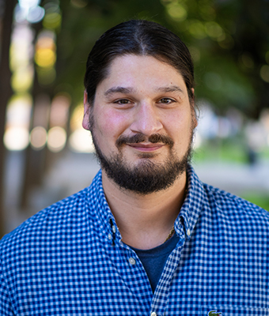
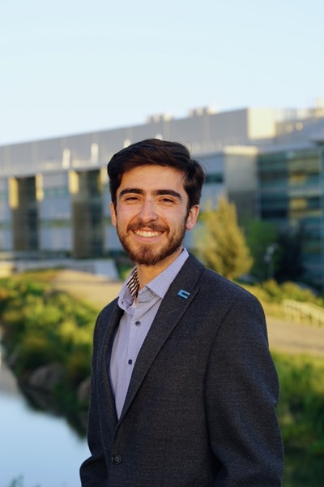
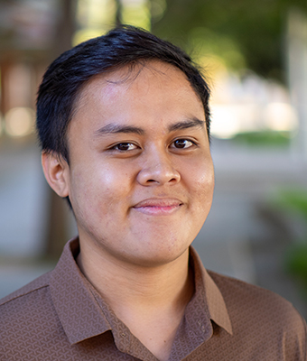
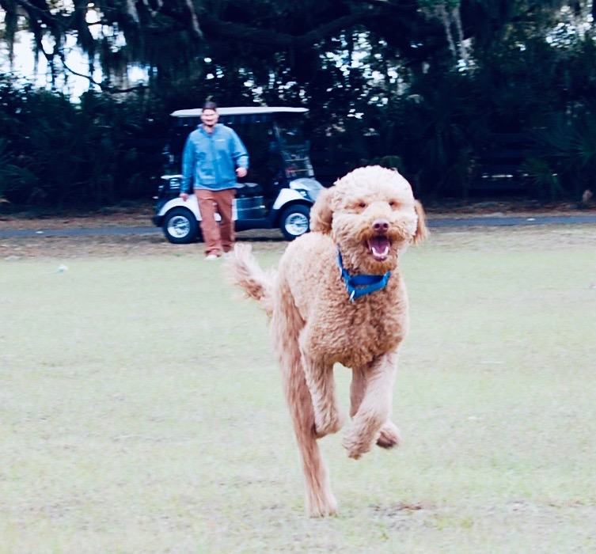

::: {.hero}
## The Team Behind the Simulation

This project is developed by graduate students in the [Energy Graduate Group](https://energy.ucdavis.edu/education/energy-graduate-group/) at the [UC Davis Energy and Efficiency Institute](https://energy.ucdavis.edu/), under the supervision of Professor Alan Jenn.
:::

## The Team

::: {.grid-4}
::: {.quick-card .team-card}
[Faculty Advisor]{.role-badge}

{.team-photo}

### Alan Jenn, Ph.D.

**Asst. Professor, CEE**
**Chair, Energy Graduate Group**

EV grid integration, vehicle adoption, transportation finance.

[CEE](https://cee.engineering.ucdavis.edu/people/alan-jenn){.btn-pill} [EEI](https://energy.ucdavis.edu/people/alan-jenn/){.btn-pill}
:::

::: {.quick-card .team-card}
[Graduate Researcher]{.role-badge}

{.team-photo}

### David MacDonald

**Master's Student, EGG**

Energy storage, microhydro, agrovoltaics, Smart Home, distributed energy, emergency preparedness.

[EEI Profile](https://energy.ucdavis.edu/people/macdonald-david/){.btn-pill}
:::

::: {.quick-card .team-card}
[Graduate Researcher]{.role-badge}

{.team-photo}

### Miguel Craven

**Master's Student, EGG**
**Student Regent, UC Regents**

Renewable energy, biofuels, public policy, energy economics.

[EEI](https://energy.ucdavis.edu/people/craven-miguel/){.btn-pill} [Regents](https://regents.universityofcalifornia.edu/about/members-and-advisors/bios/miguel-craven.html){.btn-pill}
:::

::: {.quick-card .team-card}
[Graduate Researcher]{.role-badge}

{.team-photo}

### Rayhan K.S. Moo

**Master's Student, EGG**
**Fulbright Scholar**

Energy efficiency, renewable energy, geothermal, energy policy.

[EEI Profile](https://energy.ucdavis.edu/people/khayrunnas-syarief-moo-rayhan/){.btn-pill}
:::
:::

## And One More Team Member...

::: {.grid-2}
::: {.quick-card .team-card}
{.team-photo}

### Morty

**Chief Morale Officer**

Morty is the namesake of our sister project, [MortyMonteCarlo](https://dmac716.github.io/MortyMonteCarlo/), which computes the full lifecycle assessment (manufacturing, ingredient sourcing, packaging, retail) for the same dog food products simulated here. He takes his role very seriously.
:::
:::

## Acknowledgments

::: {.panel}
This work is supported by the UC Davis Energy Graduate Group and the Institute of Transportation Studies. The distributed compute infrastructure spans Google Cloud Platform, Microsoft Azure, and GitHub Codespaces. Route geometry is provided by the Google Routes API under academic licensing.

The simulation codebase and all artifacts are open source and available on [GitHub](https://github.com/dMac716/coldchain-freight-montecarlo).
:::

---

::: {.banner-row}
[{style="max-height:60px;"}](https://energy.ucdavis.edu/)
[{style="max-height:60px;"}](https://engineering.ucdavis.edu/)
:::
