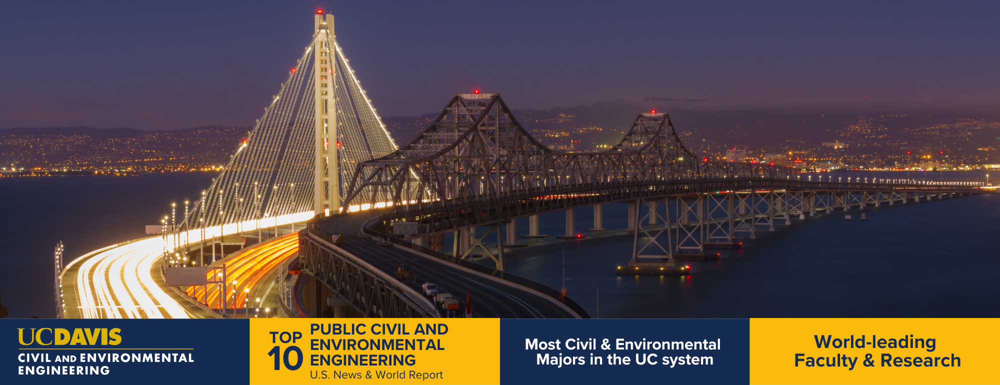

::: {.hero}
## The Team Behind the Simulation

This project is developed by graduate students in the [Energy Graduate Group](https://energy.ucdavis.edu/education/energy-graduate-group/) at the [UC Davis Energy and Efficiency Institute](https://energy.ucdavis.edu/), under the supervision of Professor Alan Jenn.
:::

## Faculty Advisor

::: {.grid-2}
::: {.quick-card style="text-align:center;"}
{width=180 style="border-radius:50%; object-fit:cover; width:180px; height:180px;"}

### Alan Jenn, Ph.D.

**Assistant Professor, Civil and Environmental Engineering**
**Chair, Energy Graduate Group**
**Institute of Transportation Studies**

Plug-in electric vehicles: integration with the electric grid, adoption of the technology, use in ride-hailing companies, and impact on transportation finance. Developer of the Grid Optimized Operation Dispatch (GOOD) model.

Ph.D. in Engineering and Public Policy, Carnegie Mellon University.

[CEE Profile](https://cee.engineering.ucdavis.edu/people/alan-jenn){.btn-pill} [EEI Profile](https://energy.ucdavis.edu/people/alan-jenn/){.btn-pill}
:::
:::

## Graduate Researchers

::: {.grid-2}
::: {.quick-card style="text-align:center;"}
{width=180 style="border-radius:50%; object-fit:cover; width:180px; height:180px;"}

### David MacDonald

**Master's Student, Energy Graduate Group**

Remote and off-grid power, energy storage, microhydro systems, agrovoltaics, Smart Home technologies, repurposed electronics, passive energy systems, distributed energy infrastructure, environmental design, and energy resilience for emergency preparedness.

David is an inventor with a software engineering and renewable energy background. He has developed applications for Apple platforms including HomeKit and CarPlay, and holds multiple provisional patents for low-energy mechanical systems.

[EEI Profile](https://energy.ucdavis.edu/people/macdonald-david/){.btn-pill}
:::

::: {.quick-card style="text-align:center;"}
{width=180 style="border-radius:50%; object-fit:cover; width:180px; height:180px;"}

### Miguel Craven

**Master's Student, Energy Graduate Group**
**Student Regent, UC Board of Regents**

Renewable energy and biofuels, public policy, energy economics.

Miguel completed his B.S. in Mechanical Engineering at UC Merced, where he served as Student Body President. His undergraduate work spanned electric vehicles, unmanned vehicles, medical assistance devices, and agricultural devices. He currently serves as Student Regent on the UC Board of Regents, advocating for housing access, freedom of expression, and diversity in higher education.

[EEI Profile](https://energy.ucdavis.edu/people/craven-miguel/){.btn-pill} [UC Regents Bio](https://regents.universityofcalifornia.edu/about/members-and-advisors/bios/miguel-craven.html){.btn-pill}
:::

::: {.quick-card style="text-align:center;"}
{width=180 style="border-radius:50%; object-fit:cover; width:180px; height:180px;"}

### Rayhan Khayrunnas Syarief Moo

**Master's Student, Energy Graduate Group**
**Fulbright Scholar**

Energy efficiency, renewable energy, geothermal, energy policy.

Rayhan is an engineering consultant based in Jakarta who earned his B.S. in Mechanical Engineering from Institut Teknologi Sepuluh Nopember, Surabaya. Through the Fulbright Master's Degree Scholarship, he is pursuing graduate studies at the UC Davis Energy Efficiency Institute.

[EEI Profile](https://energy.ucdavis.edu/people/khayrunnas-syarief-moo-rayhan/){.btn-pill}
:::
:::

## And One More Team Member...

::: {.grid-2}
::: {.quick-card style="text-align:center;"}
{width=180 style="border-radius:50%; object-fit:cover; width:180px; height:180px;"}

### Morty

**Chief Morale Officer**

Morty is the namesake of our sister project, [MortyMonteCarlo](https://dmac716.github.io/MortyMonteCarlo/), which computes the full lifecycle assessment (manufacturing, ingredient sourcing, packaging, retail) for the same dog food products simulated here. He takes his role very seriously.
:::
:::

## Acknowledgments

::: {.panel}
This work is supported by the UC Davis Energy Graduate Group and the Institute of Transportation Studies. The distributed compute infrastructure spans Google Cloud Platform, Microsoft Azure, and GitHub Codespaces. Route geometry is provided by the Google Routes API under academic licensing.

The simulation codebase and all artifacts are open source and available on [GitHub](https://github.com/dMac716/coldchain-freight-montecarlo).
:::

---

::: {style="text-align:center; margin-top:2rem;"}
[{style="max-width:400px; margin:1rem;"}](https://energy.ucdavis.edu/)

[{style="max-width:600px; margin:1rem;"}](https://cee.engineering.ucdavis.edu/)

[{style="max-width:350px; margin:1rem;"}](https://engineering.ucdavis.edu/)
:::
