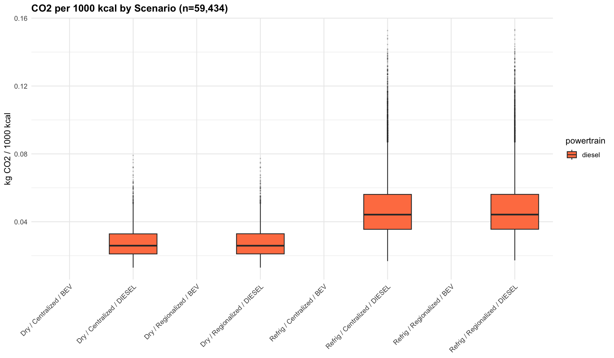
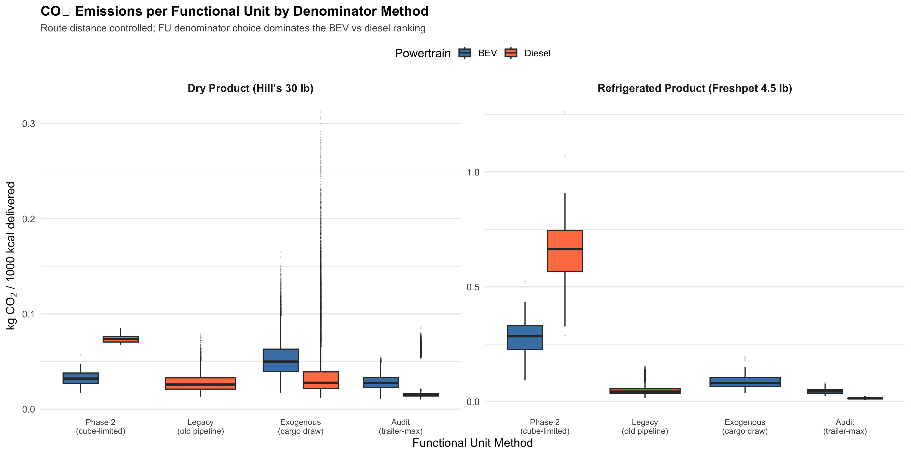
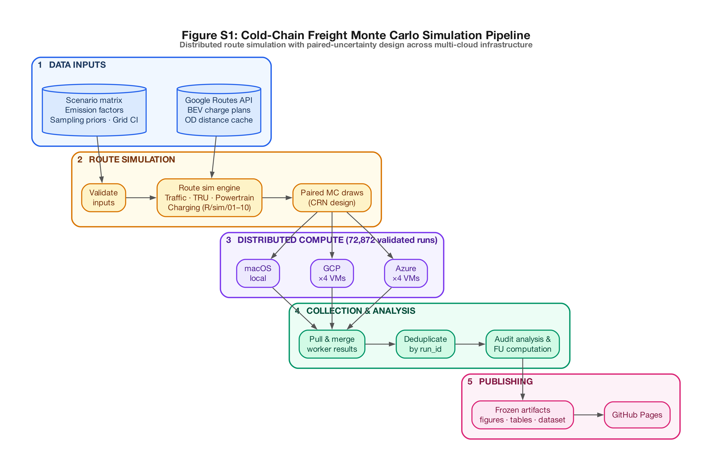

::: {.hero}
# Cold-Chain Freight Monte Carlo

Distributed Monte Carlo simulation of greenhouse gas emissions for refrigerated dog food freight under alternative spatial and powertrain scenarios.

`Latest production audit: audit_2026-03-17 | 72,872 runs | TRAFFIC_AWARE_OPTIMAL routing`
`Functional unit: kg CO2e / 1,000 kcal delivered to retail (audit-uniform method)`

::: {.cta-row}
[Methodology](methodology_results.qmd){.btn-pill}
[Route Map](viz/flow_map.qmd){.btn-pill}
[Transport Results](viz/transport_results.qmd){.btn-pill}
[Contribute Compute](contribute.qmd){.btn-pill}
:::
:::

::: {.kpi-grid}
::: {.kpi-card}
<div class="kpi-label">Scenario Dimensions</div>
<div class="kpi-value">2 x 2 x 2</div>
Spatial x Powertrain x Product
:::

::: {.kpi-card}
<div class="kpi-label">Facilities</div>
<div class="kpi-value">2</div>
Topeka KS (dry) + Ennis TX (refrigerated)
:::

::: {.kpi-card}
<div class="kpi-label">Routing</div>
<div class="kpi-value">Traffic-Aware</div>
Google Routes API
:::

::: {.kpi-card}
<div class="kpi-label">Cloud Workers</div>
<div class="kpi-value">8</div>
4 GCP + 4 Azure (2 platforms)
:::

::: {.kpi-card}
<div class="kpi-label">Total Runs</div>
<div class="kpi-value">72,872</div>
Audit-uniform FU, cross-platform validated
:::
:::

## Study Design { .section-title }

::: {.panel}
This simulation compares the lifecycle transport emissions of two distribution strategies for dog food products under diesel and battery-electric (BEV) powertrains:

| Dimension | Levels |
|-----------|--------|
| **Spatial** | Centralized (Topeka, KS) vs Regionalized (Ennis, TX) |
| **Powertrain** | Diesel Cascadia vs BEV eCascadia |
| **Product** | Dry (kibble) vs Refrigerated (fresh/frozen) |
| **Traffic** | Stochastic (time-of-day variation, incidents) |

Each paired draw uses **Common Random Numbers** (CRN) --- exogenous uncertainty is sampled once per seed, then both spatial networks are evaluated with the same draw, enabling statistically fair delta estimation.
:::

## Latest Results (March 2026 Production Audit) { .section-title }

::: {.panel}
The production audit aggregated **72,872 validated runs** (61,118 diesel + 11,754 post-fix BEV) across 8 scenarios from 4 GCP and 4 Azure workers, with 100% functional-unit coverage using the audit-uniform method.

**Headline finding:** When route distance is controlled, the inferred climate advantage of BEV versus diesel depends strongly on the functional unit denominator. Under cube-limited physical loading (phase2 load model), BEV outperforms diesel by ~57%; under trailer-max normalization (audit-uniform), diesel appears to outperform BEV.

- **Denominator-free metrics**: BEV emits 0.033 kg CO2/tonne-km vs diesel 0.051 (BEV wins by ~36%)
- **Per-mile**: BEV 1.00 kg CO2/mi vs diesel 1.55 kg/mi (BEV wins by ~36%)
- **Audit-uniform FU**: Dry BEV 0.028 vs diesel 0.020; Refrigerated BEV 0.046 vs diesel 0.015
- **BEV trip energy**: 3,955--4,097 kWh propulsion, 15--17 charging stops per 1,743-mi corridor
- Post-fix BEV runs correctly model en-route charging; all BEV runs have charge_stops > 0

This is a [companion transport analysis](https://dmac716.github.io/MortyMonteCarlo/) to the full lifecycle assessment.





See the full audit figures and FU sensitivity analysis on the [Methodology](methodology_results.qmd) and [Transport Results](viz/transport_results.qmd) pages.
:::

## Explore { .section-title }

::: {.grid-2}
::: {.quick-card}
### Route Map
Interactive map of actual driving routes from both facilities to Davis, CA with traffic-aware durations.

[Open Route Map](viz/flow_map.qmd)
:::

::: {.quick-card}
### Transport Results
Monte Carlo distributions, paired comparisons, and diagnostic figures.

[Open Transport Results](viz/transport_results.qmd)
:::

::: {.quick-card}
### Scenario Explorer
Filter and sort individual simulation runs by scenario, powertrain, and origin.

[Open Scenario Explorer](viz/scenario_explorer.qmd)
:::

::: {.quick-card}
### Methodology
Study design, input assumptions, validation gates, and scientific results.

[Open Methodology](methodology_results.qmd)
:::

::: {.quick-card}
### Animation Gallery
Route replay animations for diesel vs BEV trips, MC convergence evolution.

[Open Animations](route_sim_animation.qmd)
:::

::: {.quick-card}
### Contribute Compute
Help the project by running simulations in your GitHub Codespace or on your Mac.

[How to Help](contribute.qmd)
:::

::: {.quick-card}
### About the Team
Meet the researchers and faculty behind the simulation.

[About Us](about.qmd)
:::
:::

## Pipeline Overview { .section-title }



See the [Scripts Reference](scripts_reference.qmd) for detailed usage of each tool.

## Sister Project: Full LCA { .section-title }

::: {.panel}
This repository handles the **transport stage** of the lifecycle. The full lifecycle assessment (manufacturing, ingredient sourcing, packaging, retail) is computed in a companion project:

[MortyMonteCarlo --- Full LCA](https://dmac716.github.io/MortyMonteCarlo/){.btn-pill style="background: var(--primary); border-color: var(--primary);"}

That site mirrors and updates automatically when this repository publishes new artifacts to `artifacts/analysis_final_*/`. Both projects share the same functional unit (kg CO2e / 1,000 kcal delivered to retail) and product definitions.
:::

## Reproducibility { .section-title }

::: {.panel}
- All pages consume committed artifacts --- no live services queried during rendering
- Every simulation run records `model_version`, `inputs_hash`, `RNG seed`, and `timestamp`
- Route geometry uses Google Routes API with `TRAFFIC_AWARE_OPTIMAL` via direct shell `curl`
- Derived data files are committed to the repository for offline reproducibility

<span class="badge-soft">Offline-first</span>
<span class="badge-soft">Artifact-driven</span>
<span class="badge-soft">Deterministic under fixed seed</span>
:::

## Quick Start { .section-title }

```bash
git clone https://github.com/dMac716/coldchain-freight-montecarlo.git
cd coldchain-freight-montecarlo
make test          # Run testthat suite
make smoke         # End-to-end smoke test
quarto render site/  # Build this site locally
```
