::: {.hero}
## Executive Summary

This release documents the production audit `audit_2026-03-17` aggregating **59,434 deduplicated runs** across 8 scenarios from multi-cloud workers (4 GCP + 4 Azure).

- Scope: transport/distribution stage only
- Functional unit: `kg CO2e / 1000 kcal delivered to retail`
- Design: matched-pair uncertainty within powertrain
- Scenarios: BEV/diesel x dry/refrigerated x centralized/regionalized
- Runs: 59,434 (deduplicated)
- Validation: PASS

Previous baseline: `local_chunked_run` (80 runs, 2026-03-09) retained below for reference.
:::

## Study Design

### Scenario Structure

1. `dry_diesel`: Kansas origin, reefer OFF, diesel powertrain
2. `refrigerated_diesel`: Texas origin, reefer ON, diesel powertrain
3. `dry_bev`: Kansas origin, reefer OFF, BEV powertrain
4. `refrigerated_bev`: Texas origin, reefer ON, BEV powertrain

### Paired-Uncertainty Strategy

Within each powertrain, dry/refrigerated rows share operating-condition draws (traffic, departure, ambient, stochastic delay). Paired deltas therefore isolate refrigeration + origin effects under matched operating environments.

### Reporting Metric

For each row:

- `total_kcal_delivered = payload_kg_delivered * energy_density_kcal_per_kg`
- `co2_per_1000kcal = total_trip_co2_kg / total_kcal_delivered * 1000`

## Input Data and Assumptions

### Primary Inputs

- Route/run outputs from `outputs/distribution/local_chunked_run/phase2/*`
- Functional-unit transformed rows in `transport_sim_rows.csv`
- Scenario and product assumptions from `data/inputs_local/*.csv`

### Packaging Assumptions Used

- Dry primary packaging: measured `0.1653 kg` per `13.6 kg` bag (`0.0121` fraction)
- Refrigerated primary packaging: measured mean `0.029 kg/package` (27–31 g sensitivity)
- Secondary refrigerated cardboard: treated as separate unmeasured term (not silently added)

## Validation and QA Gates

Fail-fast checks enforce:

- scenario completeness (4 rows per replicate)
- paired-uncertainty consistency within powertrain
- dry reefer disabled (`tru_kwh=0`, `tru_gal=0`, `refrigeration_runtime_hours=0`)
- route completion before FU export
- finite positive `total_kcal_delivered`
- finite `co2_per_1000kcal`
- finite traffic metrics
- plausible route distance/time

Validation artifact:

- [Validation report](assets/transport/local_chunked_run/data/transport_sim_validation_report.txt)

## March 2026 Production Audit (59,434 runs) { .section-title }

::: {.panel}
The production audit (2026-03-17) aggregated 59,434 deduplicated runs from 4 GCP and 4 Azure workers across all 8 scenario combinations. A critical BEV charging fix was applied mid-campaign: pre-fix runs had 0 charging stops, post-fix runs correctly model en-route DCFC charging events.
:::

### Comprehensive Scenario Statistics

```{r}
#| echo: false
#| warning: false
#| message: false
cs <- utils::read.csv("assets/transport/audit_2026-03-17/tables/comprehensive_scenario_stats.csv", stringsAsFactors = FALSE)
show_cols <- c("powertrain", "product_type", "origin_network", "n_runs",
               "mean_co2_per_1000kcal", "p05_co2_per_1000kcal",
               "p50_co2_per_1000kcal", "p95_co2_per_1000kcal",
               "mean_charge_stops", "mean_distance_miles")
show_cols <- show_cols[show_cols %in% names(cs)]
names_display <- c("Powertrain", "Product", "Origin", "N",
                    "Mean CO2/1000kcal", "P05", "P50", "P95",
                    "Charge Stops", "Distance (mi)")
out <- cs[, show_cols]
names(out) <- names_display[seq_along(show_cols)]
knitr::kable(out, digits = 4)
```

### Audit Figures


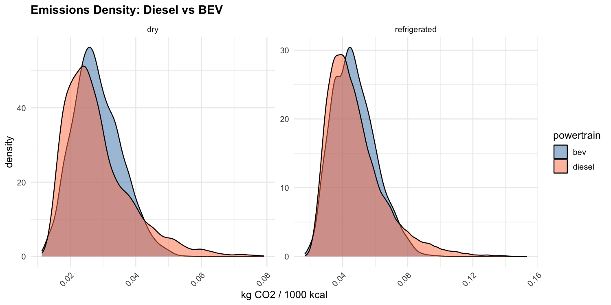

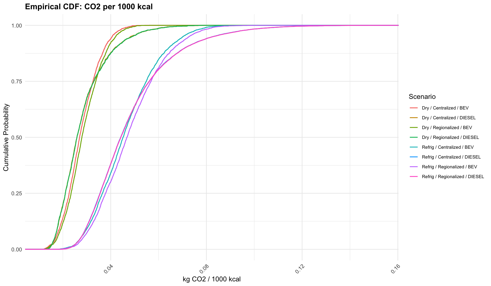

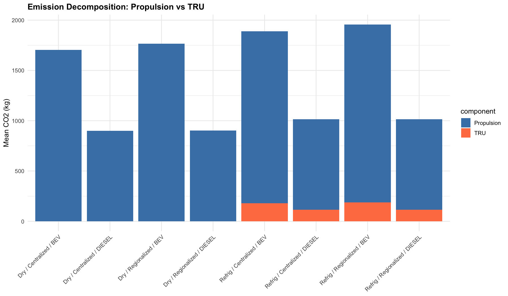

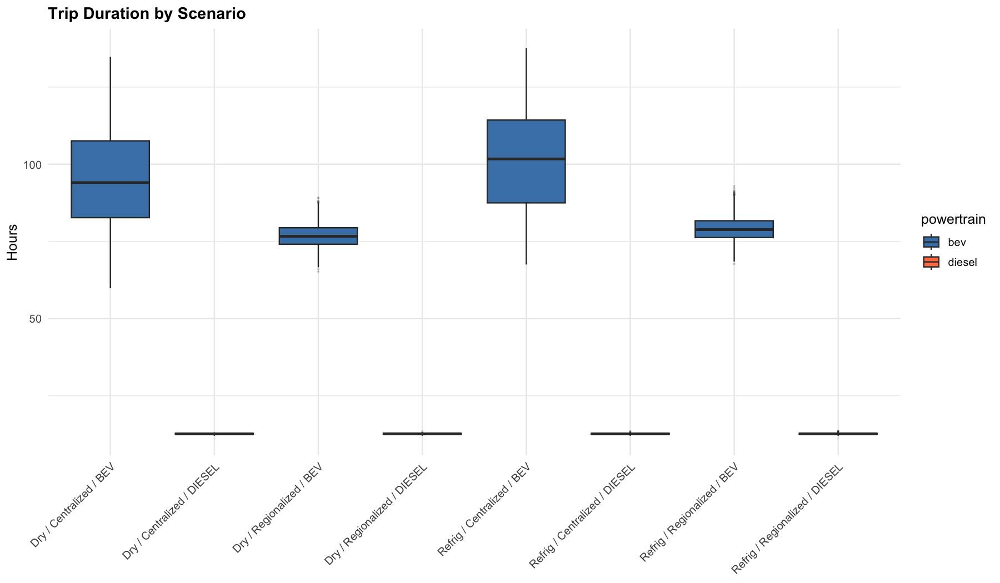

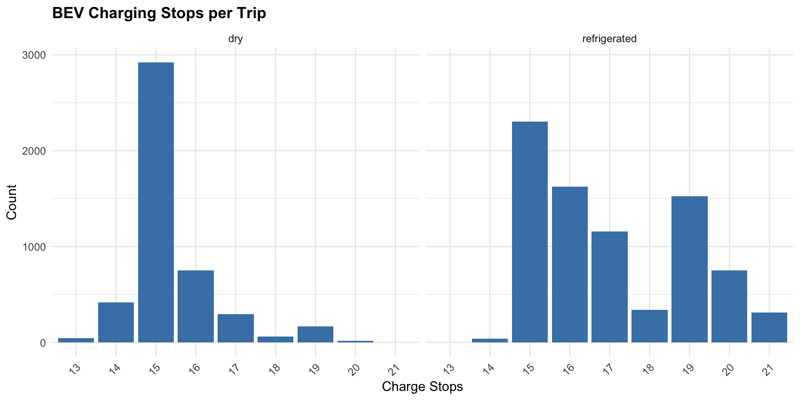

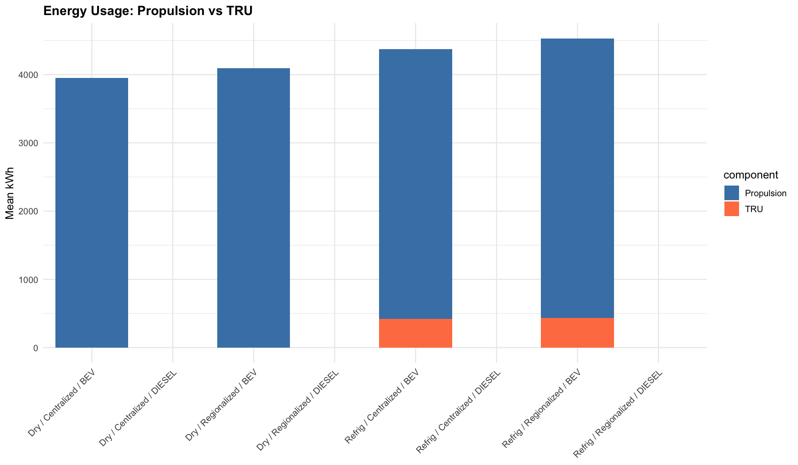

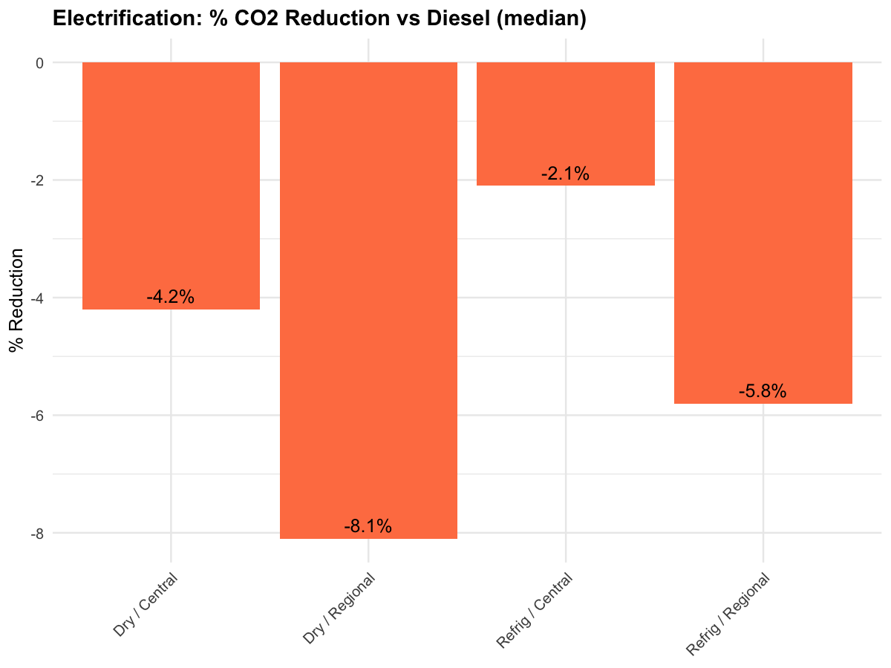

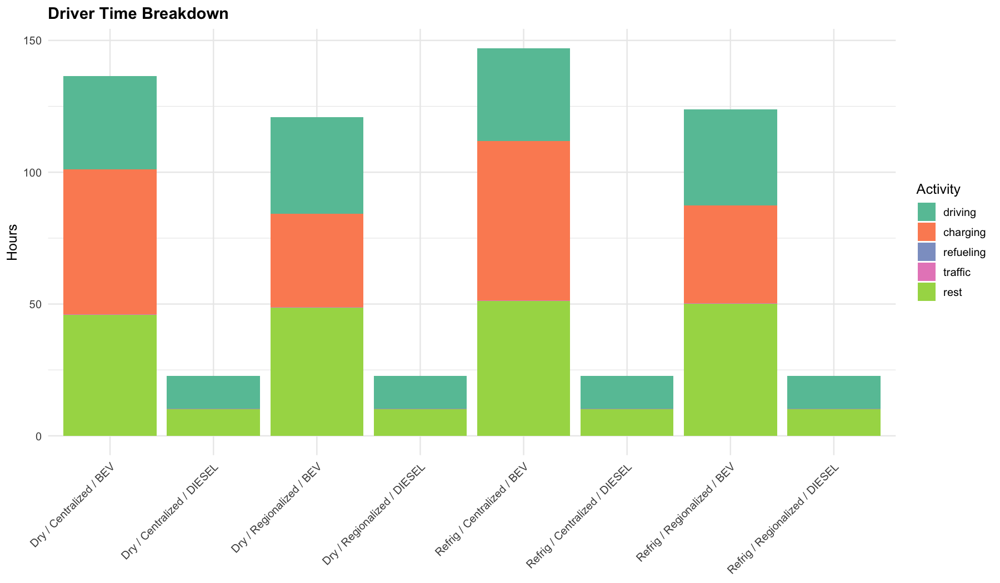

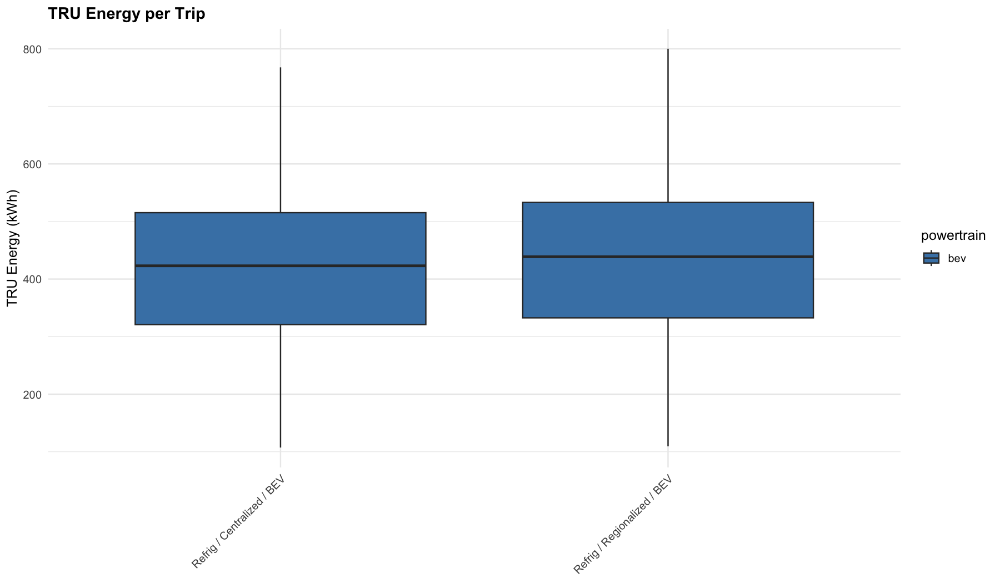

### BEV Charging Fix Context

The BEV charging continuation fix (PR #31) resolved three root causes that prevented en-route DCFC charging events from being modeled. Pre-fix BEV runs showed 0 charging stops; post-fix runs correctly model charging stops proportional to route distance.

### BEV Charging Validation

The table below compares BEV runs before and after the charging fix, demonstrating that the fix produced the expected non-zero charging stops and associated energy/time impacts.

```{r}
#| echo: false
#| warning: false
#| message: false
bev_path <- "assets/transport/audit_2026-03-17/tables/bev_charging_vs_no_charging.csv"
if (file.exists(bev_path)) {
  bev <- utils::read.csv(bev_path, stringsAsFactors = FALSE)
  knitr::kable(bev, digits = 4, caption = "BEV runs: charging fix validation — pre-fix vs post-fix comparison")
} else {
  cat("*BEV charging validation table not yet available.*")
}
```

## Previous Baseline (local_chunked_run, 80 runs, 2026-03-09) { .section-title }

### Scenario-Level Summary (Baseline)

```{r}
#| echo: false
pt <- utils::read.csv("assets/transport/local_chunked_run/data/transport_sim_powertrain_summary.csv", stringsAsFactors = FALSE)
pt <- pt[, c("scenario_name", "n", "mean", "median", "p05", "p95")]
names(pt) <- c("Scenario", "N", "Mean CO2/1000kcal", "Median", "P05", "P95")
knitr::kable(pt, digits = 6)
```

### Paired Delta Summary (Baseline)

```{r}
#| echo: false
ps <- utils::read.csv("assets/transport/local_chunked_run/data/transport_sim_paired_summary.csv", stringsAsFactors = FALSE)
if (all(c("powertrain", "n", "mean", "median", "p05", "p95") %in% names(ps))) {
  out <- unique(ps[, c("powertrain", "n", "mean", "median", "p05", "p95")])
  names(out) <- c("Powertrain", "N", "Mean Delta", "Median Delta", "P05", "P95")
  knitr::kable(out, digits = 6)
}
```

### Baseline Diagnostic Figures

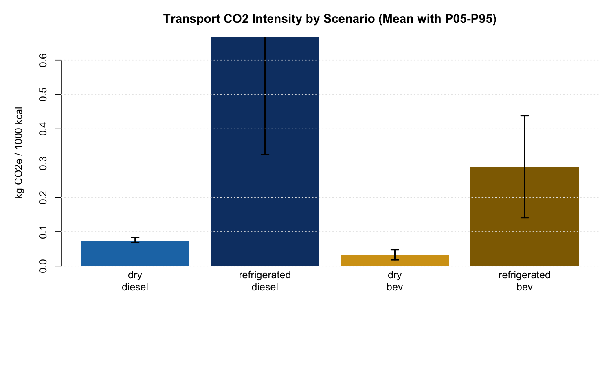

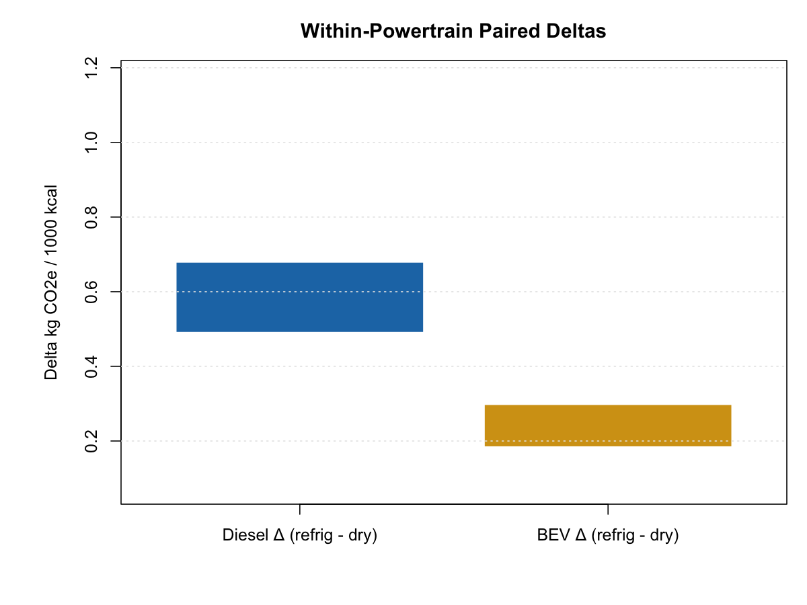

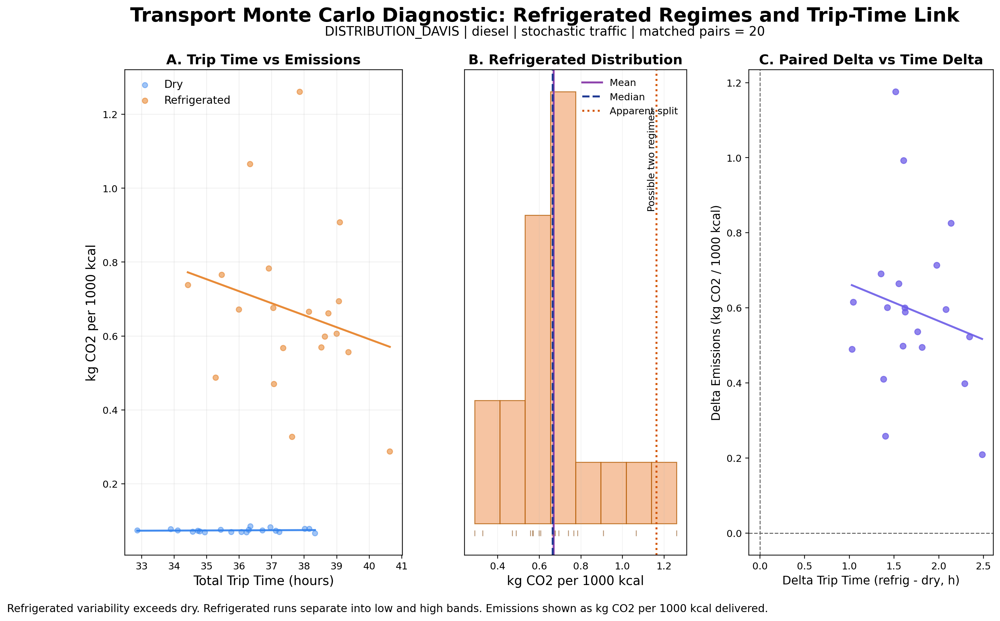

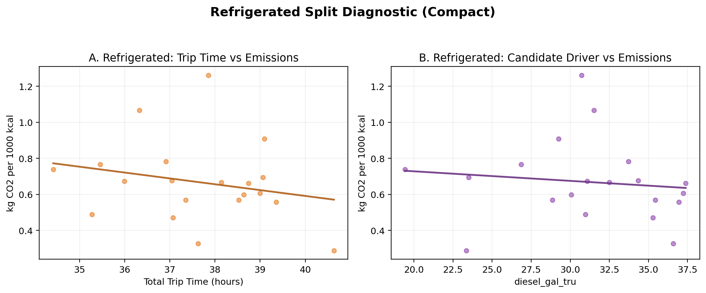

## Scientific Package and Reproducibility

### Production Audit (2026-03-17, 59,434 runs)

- Audit figures: [ZIP](assets/transport/downloads/audit_2026-03-17_figures.zip)
- Audit data: [ZIP](assets/transport/downloads/audit_2026-03-17_data.zip)

### Baseline (local_chunked_run, 80 runs)

- Scientific graphics package: `docs/assets/transport/scientific/local_chunked_run/`
- Full report bundle: [ZIP](assets/transport/downloads/local_chunked_run_report_bundle.zip)
- Data-only bundle: [ZIP](assets/transport/downloads/local_chunked_run_data.zip)
- Figure bundle: [ZIP](assets/transport/downloads/local_chunked_run_figures.zip)
- Animation bundle: [ZIP](assets/transport/downloads/local_chunked_run_animations.zip)

## Codespaces Validation Lane Status

- Codespaces validation (`N_REPS=1`) passed with expected paired structure and route identity checks.
- Last confirmed chunked production checkpoint from Codespaces logs: `chunk_done id=1 reps_done=2/20`, then `chunk_start id=2`.
- Additional live status polling was intermittently blocked by GitHub SSH/API instability from this host.

## Methods Reproduction

```bash
# 1) Merge run batches for reporting
Rscript tools/merge_mc_batches.R \
  --bundle_roots outputs/distribution/local_chunked_run/phase2/diesel,outputs/distribution/local_chunked_run/phase2/bev \
  --runs_out outputs/summaries/local_chunked_run_runs_merged.csv \
  --summary_out outputs/summaries/local_chunked_run_summary_merged.csv

# 2) Build presentation/scientific graphics + route animations
RUN_BEV_VALIDATION=false RUN_ADVANCED_DIAGNOSTICS=true RUN_SCIENTIFIC_GRAPHICS=true \
RUN_BEV_GROUPING_DIAGNOSTIC=false RUN_ROUTE_ANIMATION=true \
BUNDLE_ROOT=outputs/distribution/local_chunked_run/phase2 \
OUTDIR=outputs/presentation/transport_graphics_local_chunked_run \
RUNS_CSV=outputs/summaries/local_chunked_run_runs_merged.csv \
ANIM_OUTDIR=docs/assets/transport/animations/local_chunked_run \
bash tools/regenerate_transport_graphics.sh local_chunked_run

# 3) Render site
quarto render site/
```
