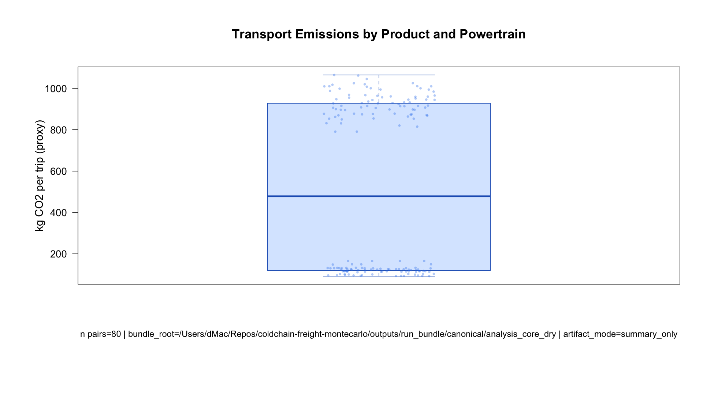
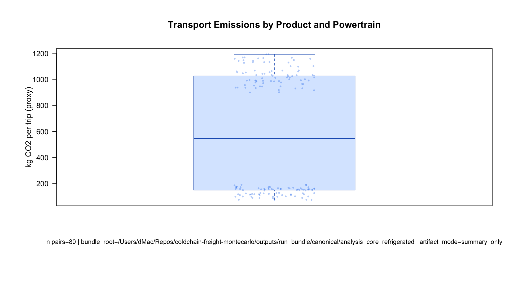
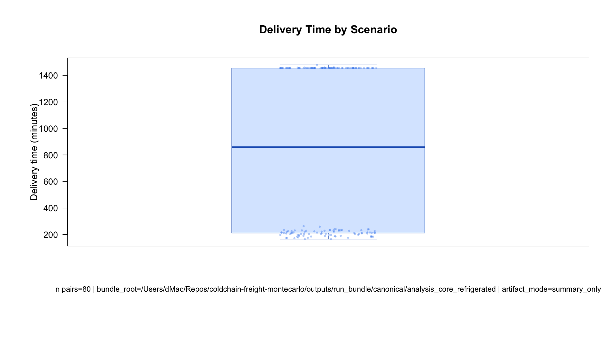
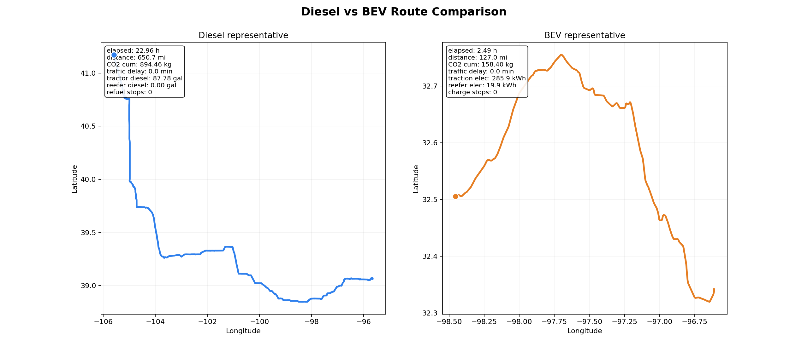

::: {.hero}
## Canonical Snapshot Summary

This page documents the validated canonical artifact build committed on **2026-03-08** and provides the first publishable results set.

::: {.cta-row}
[View Snapshot Directory](../artifacts/github_release/canonical_2026-03-08/){.btn-pill}
[Open Transport Results](viz/transport_results.qmd){.btn-pill}
:::
:::

::: {.kpi-grid}
::: {.kpi-card}

Validation

PASS

Pair integrity, figure quality, and merged LCI files
:::

::: {.kpi-card}

LCI Total Rows

4160

From merged full-LCA ledger
:::

::: {.kpi-card}

Placeholder Rows

2240

Explicit unresolved `NEEDS_SOURCE_VALUE`
:::

::: {.kpi-card}

Snapshot Path

Git Tracked

`artifacts/github_release/canonical_2026-03-08/`
:::
:::

## Methodology { .section-title }

1. Define canonical runs in `config/canonical_run_matrix.csv`.
2. Generate paired transport Monte Carlo bundles for dry/refrigerated families.
3. Build merged LCI outputs and completeness audits.
4. Build presentation artifacts and route animations.
5. Validate with `tools/validate_final_artifacts.sh` and emit release manifest/report.

::: {.panel}
### Validation Source
- `artifacts/github_release/canonical_2026-03-08/manifest/release_readiness_report.md`
:::

## Initial Results (Core Transport Metric) { .section-title }

`co2_per_1000kcal` from canonical stochastic runs:

| Product Type | Origin Network | Traffic | CO2 per 1000 kcal |
|---|---|---:|---:|
| Dry | Dry factory set | Stochastic | 517.93 |
| Dry | Refrigerated factory set | Stochastic | 518.99 |
| Refrigerated | Dry factory set | Stochastic | 584.07 |
| Refrigerated | Refrigerated factory set | Stochastic | 578.91 |

## Initial Figures { .section-title }

::: {.figure-grid}

:::

## Artifact Links { .section-title }

- GitHub-ready snapshot: `artifacts/github_release/canonical_2026-03-08/`
- Manifest/index/readiness: `.../manifest/`
- Animations and previews: `.../animations/`
- Merged LCI and completeness tables: `.../lci/`

::: {.roadmap}
### Roadmap: Animation Upgrade
Current route animations are mostly latitude/longitude playback with counters.

Next iteration should add richer map context, event overlays (charging/refuel/delay windows), and stronger scenario callouts for presentation storytelling.
:::
