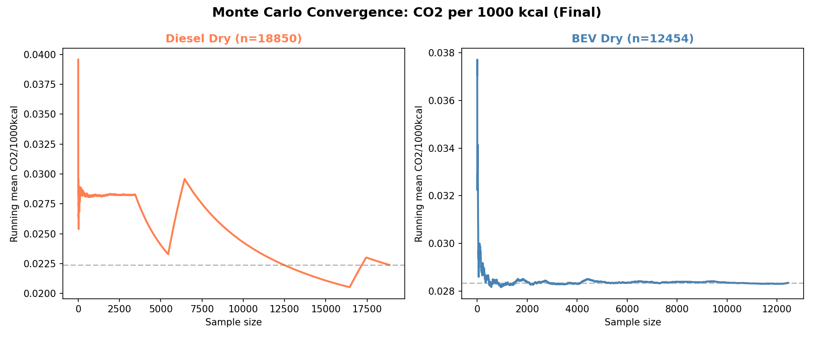
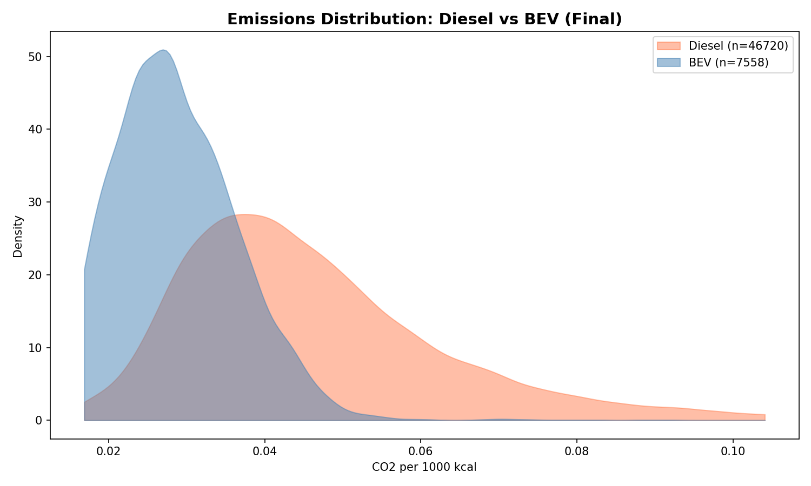
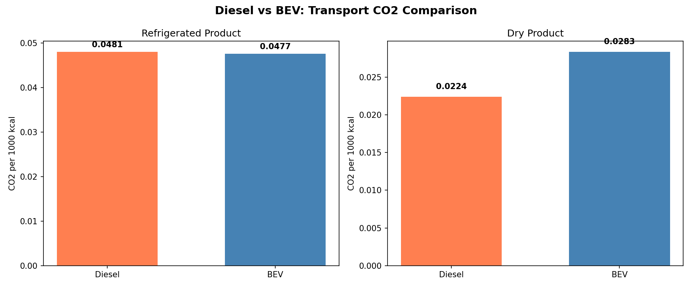

::: {.hero}
## Animation Gallery

Animation assets from the validated production audit (59,434 runs: 46,720 diesel + 12,714 post-fix BEV). MC convergence and density animations generated from the correct combined dataset with diesel baseline verified.
:::

## Production Audit Animations (March 2026)

### MC Convergence: CO2/1000kcal by Sample Size

Shows running mean convergence as sample count grows --- demonstrates statistical stability of the Monte Carlo estimates.

<video controls preload="metadata" width="100%">
  <source src="assets/transport/downloads/transport_mc_evolution.mp4" type="video/mp4">
</video>

### Emissions Density: Diesel vs BEV

Animated kernel density overlay showing the distribution of CO2/1000kcal for diesel (coral) vs BEV (blue).

<video controls preload="metadata" width="100%">
  <source src="assets/transport/downloads/transport_mc_animation.mp4" type="video/mp4">
</video>

### Diesel vs BEV: Side-by-Side Comparison

Bar chart animation comparing mean CO2/1000kcal between diesel and BEV for refrigerated and dry products.

<video controls preload="metadata" width="100%">
  <source src="assets/transport/downloads/transport_diesel_vs_bev.mp4" type="video/mp4">
</video>

## Route Replay Animations (Baseline)

These route animations show the physical truck route from facility to retail, using representative runs from the baseline `local_chunked_run`.

### Diesel Route

<video controls preload="metadata" width="100%">
  <source src="assets/transport/downloads/route_animation_diesel.mp4" type="video/mp4">
</video>

### BEV Route

<video controls preload="metadata" width="100%">
  <source src="assets/transport/downloads/route_animation_bev.mp4" type="video/mp4">
</video>

### Diesel vs BEV Route Comparison

<video controls preload="metadata" width="100%">
  <source src="assets/transport/downloads/route_animation_diesel_vs_bev.mp4" type="video/mp4">
</video>

## Static Figures from Production Audit

All 10 analysis figures from the validated 59,434-run dataset:

## Downloads

- [Audit Figures ZIP](assets/transport/downloads/audit_2026-03-17_figures.zip) (10 figures, March 2026)
- [Audit Data ZIP](assets/transport/downloads/audit_2026-03-17_data.zip) (5 tables, March 2026)
- [Baseline Animations ZIP](assets/transport/downloads/local_chunked_run_animations.zip) (route replays)
