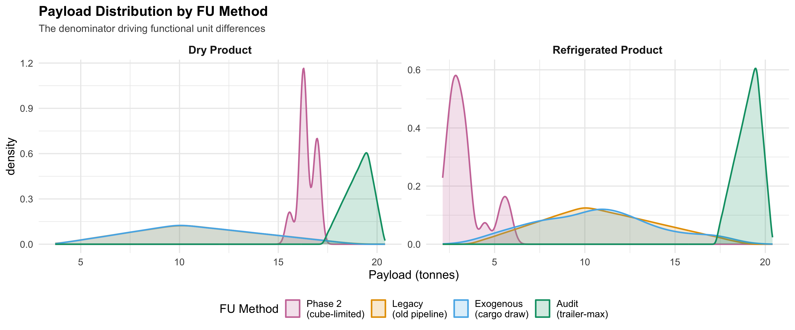

::: {.callout-note appearance="simple"}
## Total Runs: 72,872 validated across 8 scenarios
Last updated: 2026-03-18 | FU method: audit-uniform (100% coverage)
:::

::: {.hero}
## Transport Results Snapshot

Production audit: `audit_2026-03-17` | **72,872 runs** | 8 scenarios
Functional unit: `kg CO2e / 1000 kcal delivered to retail` (audit-uniform method)
Design: paired-within-powertrain uncertainty, BEV/diesel x dry/refrigerated x centralized/regionalized
:::

## Run Metadata

- Audit ID: `audit_2026-03-17`
- Scenarios: BEV/diesel x dry/refrigerated x centralized/regionalized (8 combinations)
- Total runs: 72,872 (61,118 diesel + 11,754 post-fix BEV)
- Workers: 4 GCP + 4 Azure
- Validation status: PASS
- FU method: `audit_uniform` --- payload_kg = payload_max_lb_draw x load_fraction x 0.453592
- FU coverage: 100% (all 72,872 rows)
- Reporting basis: distribution-stage transport only
- Previous baseline: `local_chunked_run` (80 runs, 2026-03-09) --- see below

## Production Audit Results (72,872 runs, audit-uniform FU)

### Comprehensive Scenario Statistics

```{r}
#| echo: false
#| warning: false
#| message: false
cs <- utils::read.csv("../assets/transport/audit_2026-03-17/tables/comprehensive_scenario_stats.csv", stringsAsFactors = FALSE)
show_cols <- c("powertrain", "product_type", "origin_network", "n_runs",
               "mean_co2_per_1000kcal", "p05_co2_per_1000kcal",
               "p50_co2_per_1000kcal", "p95_co2_per_1000kcal",
               "mean_charge_stops", "mean_distance_miles")
show_cols <- show_cols[show_cols %in% names(cs)]
out <- cs[, show_cols]
names(out) <- c("Powertrain", "Product", "Origin", "N",
                "Mean CO2/1000kcal", "P05", "P50", "P95",
                "Charge Stops", "Distance (mi)")
knitr::kable(out, digits = 4)
```

### Audit Figures


## Functional Unit Sensitivity Analysis { .section-title }

::: {.callout-important}
**Key finding:** The BEV-vs-diesel ranking reverses depending on which functional unit denominator is used. This is a first-order determinant of the comparison for refrigerated cold-chain freight.
:::

Four methods for computing the FU denominator (kcal delivered) were compared:

| Method | Payload Source | Mean Payload (kg) | Coverage |
|--------|---------------|-------------------|----------|
| **Audit uniform** | Trailer max x load fraction | ~19,050 | All 72,872 rows |
| **Exogenous draw** | Stochastic cargo weight | ~10,882 | 26,152 rows |
| **Legacy stored** | Old pipeline (unknown) | ~7,554 | 46,720 rows |
| **Phase2 load model** | Cube+weight packing | dry: 16,442 / refrig: 3,370 | 80 rows |

### BEV vs Diesel Ranking by FU Method

```{r}
#| echo: false
#| warning: false
#| message: false
rank_path <- "../assets/transport/audit_2026-03-17/tables/bev_vs_diesel_ranking.csv"
if (file.exists(rank_path)) {
  rk <- utils::read.csv(rank_path, stringsAsFactors = FALSE)
  names(rk) <- c("Product", "Method", "Diesel Mean", "BEV Mean", "BEV - Diesel", "% Reduction", "BEV Wins")
  knitr::kable(rk, digits = 4)
}
```

Under cube-limited physical loading (phase2), refrigerated product loads only ~3.4 tonnes per truck. This small denominator amplifies per-FU emissions for both powertrains, but BEV's lower absolute CO2 per trip gives it a ~57% advantage. Under trailer-max normalization (audit-uniform), payload is ~19 tonnes, inflating kcal_delivered by ~5.6x for refrigerated freight and erasing the BEV advantage --- an artifact of the denominator assumption.




### Denominator-Free Metrics (FU-Insensitive)

To avoid denominator dependence, ISO 14083-aligned metrics are also reported:

```{r}
#| echo: false
#| warning: false
#| message: false
tkm_path <- "../assets/transport/audit_2026-03-17/tables/tonne_km_and_mile_stats.csv"
if (file.exists(tkm_path)) {
  tkm <- utils::read.csv(tkm_path, stringsAsFactors = FALSE)
  show <- c("powertrain", "product_type", "n", "mean_co2_per_tkm", "mean_co2_per_mile", "mean_co2_per_trip")
  show <- show[show %in% names(tkm)]
  out <- tkm[, show]
  names(out) <- c("Powertrain", "Product", "N", "CO2/tonne-km", "CO2/mile", "CO2/trip (kg)")
  knitr::kable(out, digits = 4)
}
```

On a per-tonne-km basis, BEV (0.033) outperforms diesel (0.051) by ~36% for dry product, independent of the FU denominator choice. Per-mile, BEV (1.00 kg/mi) outperforms diesel (1.55 kg/mi) by ~36%.

### FU Sensitivity Summary by Method

```{r}
#| echo: false
#| warning: false
#| message: false
fu_path <- "../assets/transport/audit_2026-03-17/tables/fu_sensitivity_summary.csv"
if (file.exists(fu_path)) {
  fu <- utils::read.csv(fu_path, stringsAsFactors = FALSE)
  names(fu) <- c("Product", "Powertrain", "FU Method", "N", "Mean CO2/FU", "SD", "P05", "P50", "P95", "Mean Payload (kg)")
  knitr::kable(fu, digits = 4)
}
```

## Previous Baseline (local_chunked_run, 80 runs) { .section-title }

### Core Scenario Results (Baseline)

```{r}
#| echo: false
#| warning: false
#| message: false
pt <- utils::read.csv("../assets/transport/local_chunked_run/data/transport_sim_powertrain_summary.csv", stringsAsFactors = FALSE)
pt <- pt[, c("scenario_name", "n", "mean", "median", "p05", "p95")]
names(pt) <- c("Scenario", "N", "Mean", "Median", "P05", "P95")
knitr::kable(pt, digits = 6)
```

### Paired Delta Results (Baseline)

```{r}
#| echo: false
#| warning: false
#| message: false
ps <- utils::read.csv("../assets/transport/local_chunked_run/data/transport_sim_paired_summary.csv", stringsAsFactors = FALSE)
keep <- c("powertrain", "n", "mean", "median", "p05", "p95")
if (all(keep %in% names(ps))) {
  out <- unique(ps[, keep])
  names(out) <- c("Powertrain", "N", "Mean Delta", "Median Delta", "P05", "P95")
  knitr::kable(out, digits = 6)
}
```

### Baseline Diagnostic Figures


## Animation Outputs

### Monte Carlo Dynamics

<video controls preload="metadata" width="100%">
  <source src="../assets/transport/local_chunked_run/figures/transport_mc_animation.mp4" type="video/mp4">
</video>

<video controls preload="metadata" width="100%">
  <source src="../assets/transport/local_chunked_run/figures/transport_mc_evolution.mp4" type="video/mp4">
</video>

### Route Comparison (Diesel vs BEV)

::: {.callout-note}
**Updated:** Route comparison animations regenerated from the 72,872-run audit-uniform dataset with correct reefer metrics (diesel TRU: 11.2 gal/trip, BEV electric TRU: 439 kWh/trip).
:::

<video controls preload="metadata" width="100%">
  <source src="../assets/transport/downloads/route_animation_diesel_vs_bev.mp4" type="video/mp4">
</video>

<video controls preload="metadata" width="100%">
  <source src="../assets/transport/downloads/route_animation_diesel.mp4" type="video/mp4">
</video>

<video controls preload="metadata" width="100%">
  <source src="../assets/transport/downloads/route_animation_bev.mp4" type="video/mp4">
</video>

If your browser blocks inline playback from GitHub Pages, use the direct download bundle below.

## Download Bundles

### Production Audit (2026-03-17, 72,872 runs, audit-uniform FU)

- [Audit figures ZIP](../assets/transport/downloads/audit_2026-03-17_figures.zip) (24 figures including FU sensitivity)
- [Audit data ZIP](../assets/transport/downloads/audit_2026-03-17_data.zip) (7 tables + 2 memos)

### Baseline (local_chunked_run, 80 runs)

- [Full report bundle ZIP](../assets/transport/downloads/local_chunked_run_report_bundle.zip)
- [Data ZIP](../assets/transport/downloads/local_chunked_run_data.zip)
- [Figures ZIP](../assets/transport/downloads/local_chunked_run_figures.zip)
- [Animations ZIP](../assets/transport/downloads/local_chunked_run_animations.zip)

Raw files:

- [Rows CSV](../assets/transport/local_chunked_run/data/transport_sim_rows.csv)
- [Paired summary CSV](../assets/transport/local_chunked_run/data/transport_sim_paired_summary.csv)
- [Powertrain summary CSV](../assets/transport/local_chunked_run/data/transport_sim_powertrain_summary.csv)
- [Graphics input CSV](../assets/transport/local_chunked_run/data/transport_sim_graphics_inputs.csv)
- [Validation report](../assets/transport/local_chunked_run/data/transport_sim_validation_report.txt)
- [Merged runs CSV](../assets/transport/local_chunked_run/data/local_chunked_run_runs_merged.csv)
