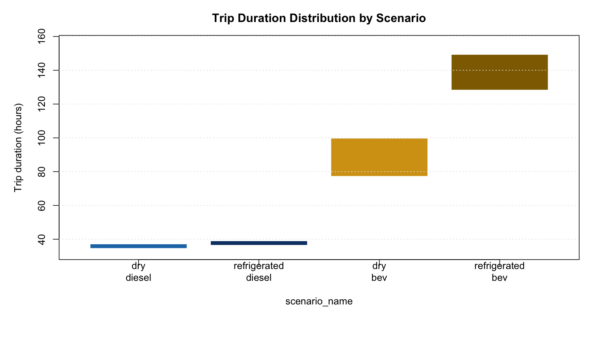
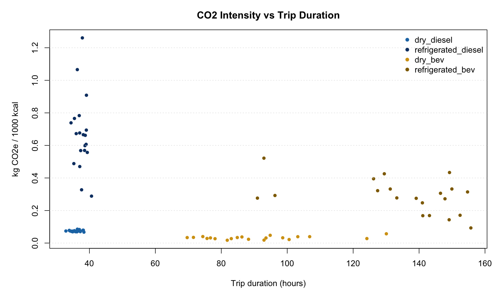

::: {.hero}
## Transport Results Snapshot

Production audit: `audit_2026-03-17` | **70,174 runs** | 8 scenarios
Functional unit: `kg CO2e / 1000 kcal delivered to retail`
Design: paired-within-powertrain uncertainty, BEV/diesel x dry/refrigerated x centralized/regionalized
:::

## Run Metadata

- Audit ID: `audit_2026-03-17`
- Scenarios: BEV/diesel x dry/refrigerated x centralized/regionalized (8 combinations)
- Total runs: 70,174 (deduplicated)
- Workers: 4 GCP + 4 Azure
- Validation status: PASS
- Reporting basis: distribution-stage transport only
- Previous baseline: `local_chunked_run` (80 runs, 2026-03-09) --- see below

## Production Audit Results (70,174 runs)

### Comprehensive Scenario Statistics

```{r}
#| echo: false
#| warning: false
#| message: false
cs <- utils::read.csv("../assets/transport/audit_2026-03-17/tables/comprehensive_scenario_stats.csv", stringsAsFactors = FALSE)
show_cols <- c("powertrain", "product_type", "origin_network", "n_runs",
               "mean_co2_per_1000kcal", "p05_co2_per_1000kcal",
               "p50_co2_per_1000kcal", "p95_co2_per_1000kcal",
               "mean_charge_stops", "mean_distance_miles")
show_cols <- show_cols[show_cols %in% names(cs)]
out <- cs[, show_cols]
names(out) <- c("Powertrain", "Product", "Origin", "N",
                "Mean CO2/1000kcal", "P05", "P50", "P95",
                "Charge Stops", "Distance (mi)")
knitr::kable(out, digits = 4)
```

### Audit Figures


## Previous Baseline (local_chunked_run, 80 runs) { .section-title }

### Core Scenario Results (Baseline)

```{r}
#| echo: false
#| warning: false
#| message: false
pt <- utils::read.csv("../assets/transport/local_chunked_run/data/transport_sim_powertrain_summary.csv", stringsAsFactors = FALSE)
pt <- pt[, c("scenario_name", "n", "mean", "median", "p05", "p95")]
names(pt) <- c("Scenario", "N", "Mean", "Median", "P05", "P95")
knitr::kable(pt, digits = 6)
```

### Paired Delta Results (Baseline)

```{r}
#| echo: false
#| warning: false
#| message: false
ps <- utils::read.csv("../assets/transport/local_chunked_run/data/transport_sim_paired_summary.csv", stringsAsFactors = FALSE)
keep <- c("powertrain", "n", "mean", "median", "p05", "p95")
if (all(keep %in% names(ps))) {
  out <- unique(ps[, keep])
  names(out) <- c("Powertrain", "N", "Mean Delta", "Median Delta", "P05", "P95")
  knitr::kable(out, digits = 6)
}
```

### Baseline Diagnostic Figures







## Animation Outputs

### Monte Carlo Dynamics

<video controls preload="metadata" width="100%">
  <source src="../assets/transport/local_chunked_run/figures/transport_mc_animation.mp4" type="video/mp4">
</video>

<video controls preload="metadata" width="100%">
  <source src="../assets/transport/local_chunked_run/figures/transport_mc_evolution.mp4" type="video/mp4">
</video>

### Route Comparison (Diesel vs BEV)

<video controls preload="metadata" width="100%">
  <source src="../assets/transport/downloads/route_animation_diesel_vs_bev.mp4" type="video/mp4">
</video>

<video controls preload="metadata" width="100%">
  <source src="../assets/transport/downloads/route_animation_diesel.mp4" type="video/mp4">
</video>

<video controls preload="metadata" width="100%">
  <source src="../assets/transport/downloads/route_animation_bev.mp4" type="video/mp4">
</video>

If your browser blocks inline playback from GitHub Pages, use the direct download bundle below.

## Download Bundles

- [Full report bundle ZIP](../assets/transport/downloads/local_chunked_run_report_bundle.zip)
- [Data ZIP](../assets/transport/downloads/local_chunked_run_data.zip)
- [Figures ZIP](../assets/transport/downloads/local_chunked_run_figures.zip)
- [Animations ZIP](../assets/transport/downloads/local_chunked_run_animations.zip)

Raw files:

- [Rows CSV](../assets/transport/local_chunked_run/data/transport_sim_rows.csv)
- [Paired summary CSV](../assets/transport/local_chunked_run/data/transport_sim_paired_summary.csv)
- [Powertrain summary CSV](../assets/transport/local_chunked_run/data/transport_sim_powertrain_summary.csv)
- [Graphics input CSV](../assets/transport/local_chunked_run/data/transport_sim_graphics_inputs.csv)
- [Validation report](../assets/transport/local_chunked_run/data/transport_sim_validation_report.txt)
- [Merged runs CSV](../assets/transport/local_chunked_run/data/local_chunked_run_runs_merged.csv)
